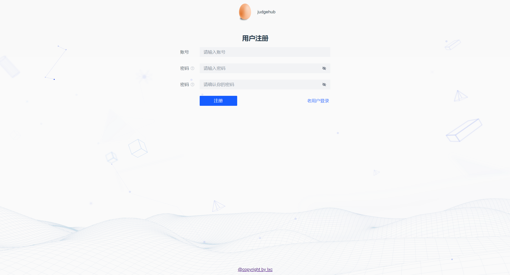

# 前端项目vue模板初始化
# 模板能力
- 集成登录
- 快速开发管理功能（增删改查）

# 模板特点

## 主流框架 & 特性
- **Vue-Cli初始化脚手架**
- **vue3**
- Node 至少 16 版本及以上
- **TypeScript**
- 动态路由
- Eslint
- Prettier

## Ant Design Pro 架构

### Umi
- Node.js 前端开发基础环境
- Webpack 前端必学必会的打包工具
- vue-router 路由库
- Fabric 严格但是不严苛的 lint 规则集（eslint、stylelint、prettier)
- TypeScript 带类型的 JavaScript

## 业务特性
- 栅格布局（可自定义，可适应）
- 简单权限管理
- 全局初始数据（`getInitialState`）
- 默认使用 less 作为样式语言
- OpenAPI 自动生成后端请求代码
- 统一错误处理

## 业务功能
- 提供 OpenAPI 后端接口自动生成
- 用户登录、用户注册
- 管理员修改用户、新建用户、查询用户、删除用户
- 动态路由展示（权限管理）

# 快速上手

1. 先启动后端的万用模板
2. 使用命令生成后端请求代码
3. 将标题和 logo 等切换为个人
4. 测试业务功能
